# **Taskmaster**
## Creating building an Android app that will be the main focus of the second half of the course: TaskMaster.

 

# **Lab 26:**
### Add a Task: It allow users to type in details about a new task.
### All Tasks: It should just be an image with a back button; it needs no functionality.
### Homepage: It should have a heading at the top of the page, an image to mock the “my tasks” view, and buttons at the bottom of the page to allow going to the **“add tasks”** and **“all tasks”** page.

 

# **Lab 27:**
### Task Detail Page: It should have a title at the top of the page, and a Lorem Ipsum description.

 

### Settings Page: It should allow users to enter their username and hit save.

 

### Homepage: It should be modified to contain three different buttons with hardcoded task titles....

 

# **Lab 28:**
### Task Model: A Task should have a title, a body, and a state. The state should be one of “new”, “assigned”, “in progress”, or “complete”.
### Homepage: Refactor your homepage to use a RecyclerView for displaying Task data. This should have hardcoded Task data for now.

 

# **Lab29:**
### Add Task Form: Modify your Add Task form to save the data entered in as a Task in your local database.

 

### Homepage: Refactor your homepage’s RecyclerView to display all Task entities in your database.

# **Lab31:**
### Espresso
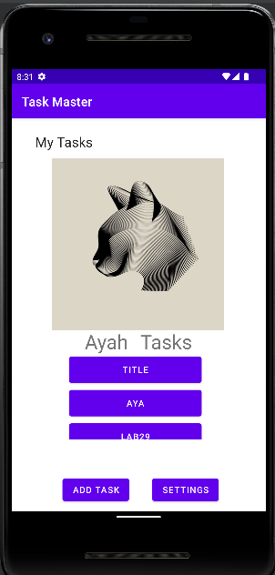

# **Lab32:**
### Integrating AWS for Cloud Data Storage
#### Modify your Add Task form to save the data entered in as a Task to DynamoDB.
+ AddTask Page

 
  
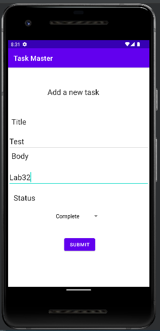

 

+ HomePage
 
 

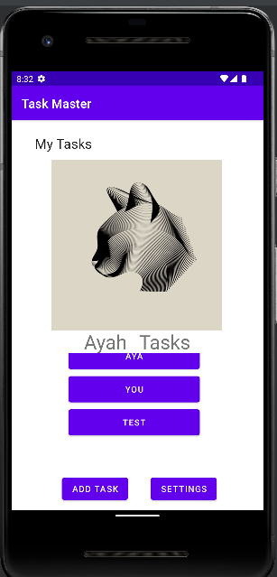

 

+ AWS Table
  
 

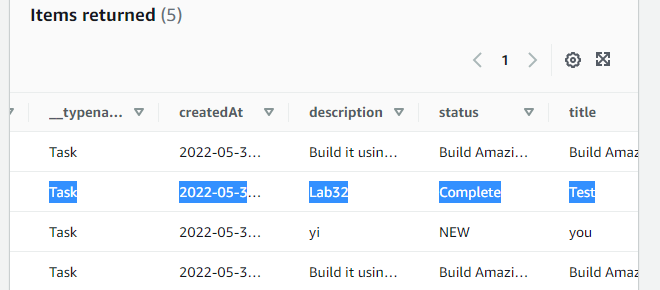

# **Lab33:**
### **HomePage**
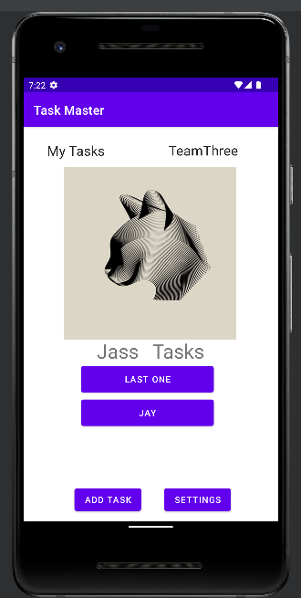
 
#### Modify your Add Task form to include either a Spinner or Radio Buttons for which team that task belongs to.

+ AddTask Page
Modify your Add Task form to include either a Spinner or Radio Buttons for which team that task belongs to.
  
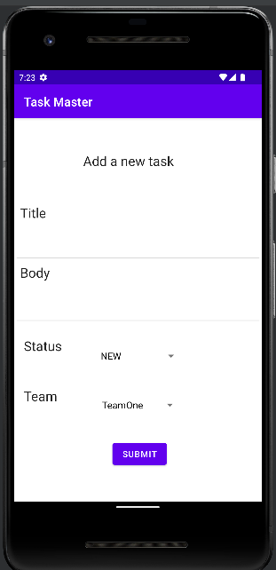

 

+ Settings Page

 

In addition to a username, allow the user to choose their team on the Settings page. Use that Team to display only that team’s tasks on the homepage.

 

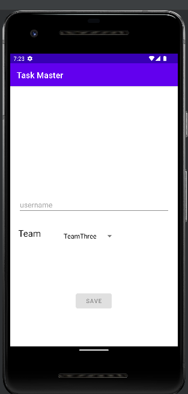

# **Lab34:**

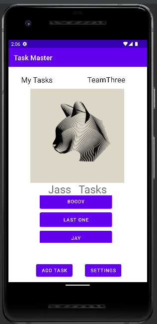

 
 

Publishing is the general process that makes your Android applications available to users. When you publish an Android application you perform two main tasks:
You prepare the application for release. During the preparation step you build a release version of your application, which users can download and install on their Android-powered devices.

You release the application to users. During the release step you publicize, sell, and distribute the release version of your application to users.

Preparing your app for release
Preparing your application for release is a multi-step process that involves the following tasks:

Configuring your application for release.
Building and signing a release version of your application.
Testing the release version of your application.
Updating application resources for release.
Preparing remote servers and services that your application depends on.
Releasing your app to users
You can release your Android applications several ways. Usually, you release applications through an application marketplace such as Google Play, but you can also release applications on your own website or by sending an application directly to a user.

# **Lab36:**

### User Login
##### Add Cognito to your Amplify setup. Add in user login and sign up flows to your application, using Cognito’s pre-built UI as appropriate. Display the logged-in user’s username (or nickname) somewhere relevant in your app.
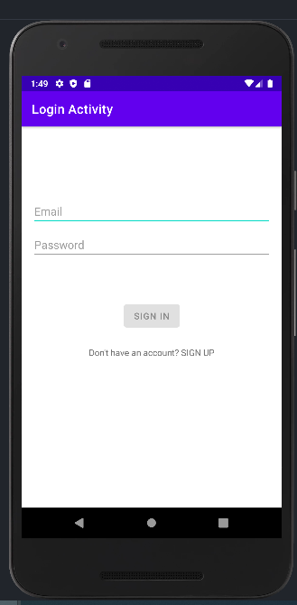

### To Registration:
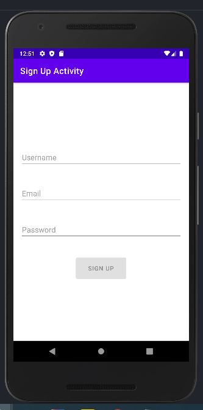

### User Logout
##### Allow users to log out of your application.
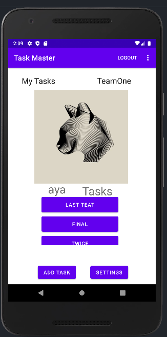

# **Lab37:**

### Upload Image
##### On the “Add a Task” activity, allow users to optionally select an image to attach to that task. If a user attaches an image to a task, that image should be uploaded to S3, and associated with that task.
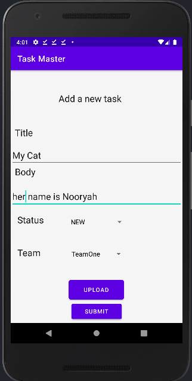

### Displaying Files:
##### On the Task detail activity, if there is a file that is an image associated with a particular Task, that image should be displayed within that activity.
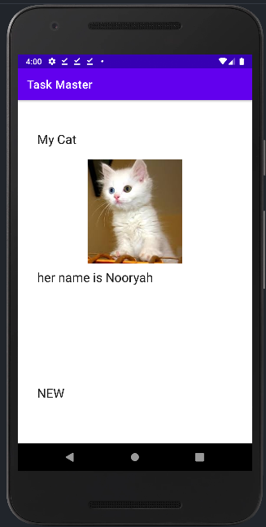

# **Lab38:**
##### Feature Tasks: Adding a Task from Another Application
###### Add an intent filter to your application such that a user can hit the “share” button on an image in another application, choose TaskMaster as the app to share that image with, and be taken directly to the Add a Task activity with that image pre-selected.

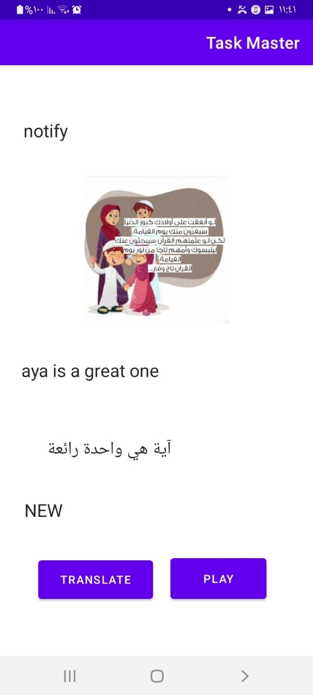

# **Lab39:**
### Location
##### When the user adds a task, their location should be retrieved and included as part of the saved Task.

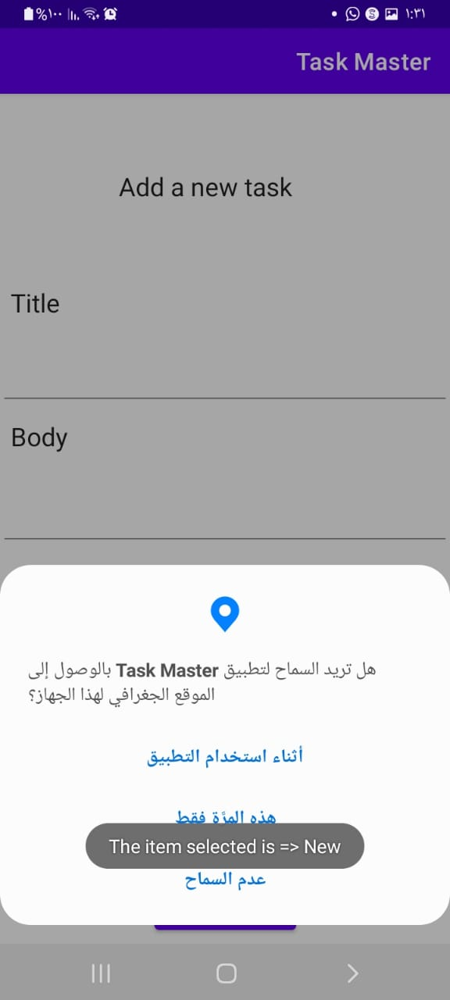

### Displaying Location
#### On the Task Detail activity, the location of a Task should be displayed if it exists.

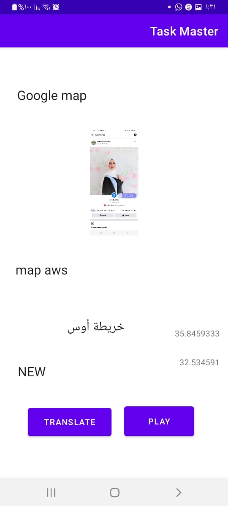

# **Lab41:**

### Analytics
##### On the “Main” activity (and any other activities you like), start recording at least one AnalyticsEvent. Make sure you can view instances of that event, including their custom properties, in Amazon Pinpoint.
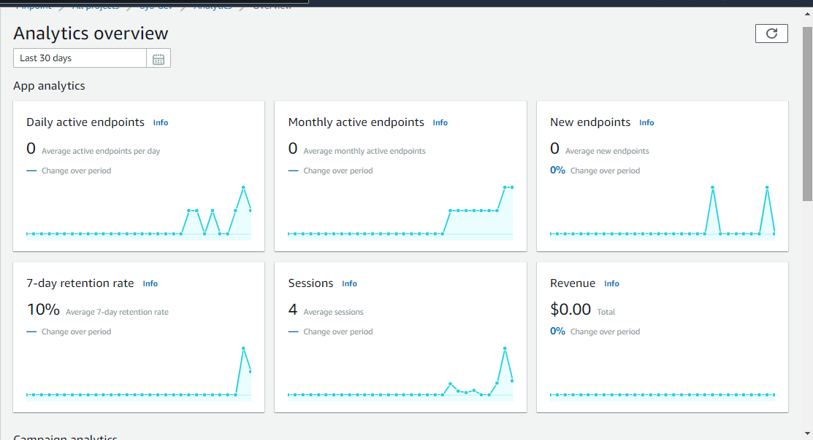

### Text To Speech:
##### On the Task Detail activity, add a button to read out the task’s description using the Amplify Predictions library.
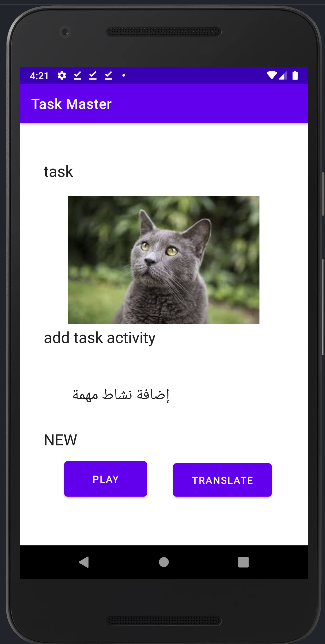

Banner Ad
On the “Main” activity, add a banner ad to the bottom of the page and display a Google test ad there.

Interstitial Ad
Add a button to the “Main” activity that allows users to see an interstitial ad. (In a real app, you’ll want to show this during natural transitions/pauses in your app, but we don’t really have that in this application.)

Rewarded Ad
Add a button to the “Main” activity that allows users to see a rewarded ad using a Google test ad. When the user clicks the close button, the user should see their reward in a text field next to the button.

# **Lab42:**

### Banner Ad:
##### On the “Main” activity, add a banner ad to the bottom of the page and display a Google test ad there.
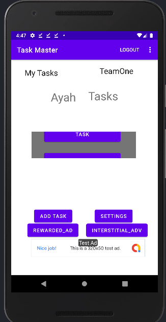

### Interstitial Ad:
##### Add a button to the “Main” activity that allows users to see an interstitial ad. (In a real app, you’ll want to show this during natural transitions/pauses in your app, but we don’t really have that in this application.)
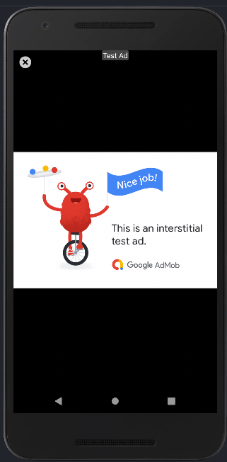

### Rewarded Ad:
##### Add a button to the “Main” activity that allows users to see a rewarded ad using a Google test ad. When the user clicks the close button, the user should see their reward in a text field next to the button.
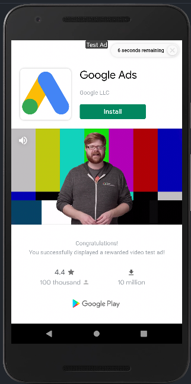
