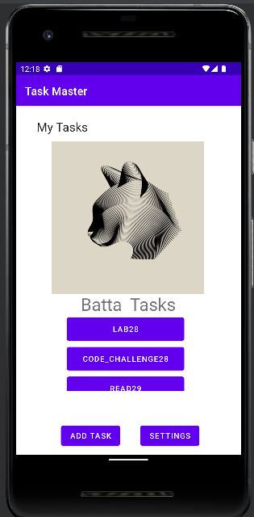

# **Taskmaster**
## Creating building an Android app that will be the main focus of the second half of the course: TaskMaster.

 

# **Lab 26:**
### Add a Task: It allow users to type in details about a new task.
### All Tasks: It should just be an image with a back button; it needs no functionality.
### Homepage: It should have a heading at the top of the page, an image to mock the “my tasks” view, and buttons at the bottom of the page to allow going to the **“add tasks”** and **“all tasks”** page.

 

# **Lab 27:**
### Task Detail Page: It should have a title at the top of the page, and a Lorem Ipsum description.
### Settings Page: It should allow users to enter their username and hit save.
### Homepage: It should be modified to contain three different buttons with hardcoded task titles....

 

# **Lab 28:**
### Task Model: A Task should have a title, a body, and a state. The state should be one of “new”, “assigned”, “in progress”, or “complete”.
### Homepage: Refactor your homepage to use a RecyclerView for displaying Task data. This should have hardcoded Task data for now.

